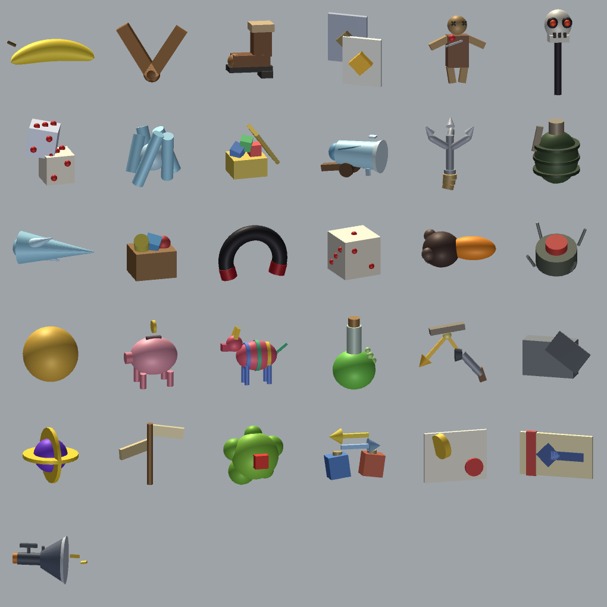

# PummelItems

Custom board items for [Pummel Party](https://store.steampowered.com/app/880940/). A
MelonLoader mod that adds new items to the game board — the ones you pick up on item spaces
and carry between turns, not anything inside the minigames.

Every item is built from scratch: its own model, its own icon, its own sound. Nothing is
reused from the game's own items.

## What it adds

| Group | What is in it |
| --- | --- |
| Thrown | banana bomb, frag grenade, sticky bomb, icicle, ricochet spread, boomerang |
| Aimed at a player | curse, freeze, life magnet, grapple, boot, ticket to the start |
| Dice meddling | loaded die, double move |
| Traps left behind | land mine, poisoned space, fake signpost |
| Board-wide | death wand, armageddon, vacuum, piggy bank |
| Money and swaps | tax, generosity, piñata, junk, swap bag, copier, shuffle orb, glass cannon |

Items are split into ordinary ones and supers. Supers only come from weapon spaces, never as
a minigame reward, which is how the game treats its own. Ordinary items are graded by strength
and slot into the existing placement-based reward tables, so finishing first is still worth
more than finishing last.

The full list, with what each one does and where it can drop, is in [ITEMS.md](ITEMS.md)
(Russian).

## Requirements

- Pummel Party on Steam
- [MelonLoader](https://melonloader.co/) 0.7.3 (Mono backend — the game is Unity 2021.3.45f2)

## Install

1. Install MelonLoader into the game folder and run the game once so it sets itself up.
2. Copy `PummelCustomItems.dll` into `<game>/Mods/`.
3. Copy the `pciassets` bundle into `<game>/UserData/PummelCustomItems/`.

Both files are on the [releases page](../../releases); building them yourself is below.

## Playing online

**Turn the mod off before joining anyone.** The items exist only on your machine — whoever
joins has no prefabs and no matching item ids for them, and the session will not survive it.

MelonLoader can switch itself off, so there is nothing to uninstall. `switch-mod.ps1`
(Windows) and `switch-mod.sh` (Steam Deck / Linux) flip the flag, and on Windows
`Play Modded.bat` / `Play Vanilla.bat` do it in one click and launch the game.

See [SWITCHING.md](SWITCHING.md) — it covers the Steam Deck too.

## Building

**The mod.** `mod/build.ps1` compiles the sources with a standalone Roslyn (`csc.exe` from the
[Microsoft.Net.Compilers.Toolset](https://www.nuget.org/packages/Microsoft.Net.Compilers.Toolset)
package) and copies the result into the game's `Mods` folder. No .NET SDK needed. Put the
compiler under `tools/` — it is not committed here.

**The assets.** `build-assets.ps1` drives Unity in batch mode to build the AssetBundle and
deploys it. It needs **Unity 2021.3.45f2** specifically, the same build the game ships with —
a bundle from another version will not load. Models and sounds are generated by the editor
scripts under `unity/PPAssets/Assets/Editor/`, so there is no binary art to keep in the repo.

`IconPreview.RenderSheet` renders every icon into one contact sheet for review without
launching the game. Run Unity **without** `-nographics` for that, or there is no device to
render with.

## Credits

Sound effects are from [Kenney](https://kenney.nl/) — the Casino Audio, Impact Sounds, RPG
Audio and Sci-Fi Sounds packs, all released under CC0. Attribution is not required by that
licence; it is here because the work deserves it.

Everything else — code, models, icons — is original to this project.

## Licence

MIT, see [LICENSE](LICENSE).

Not affiliated with or endorsed by Rebuilt Games. No game code or game assets are included in
this repository.
