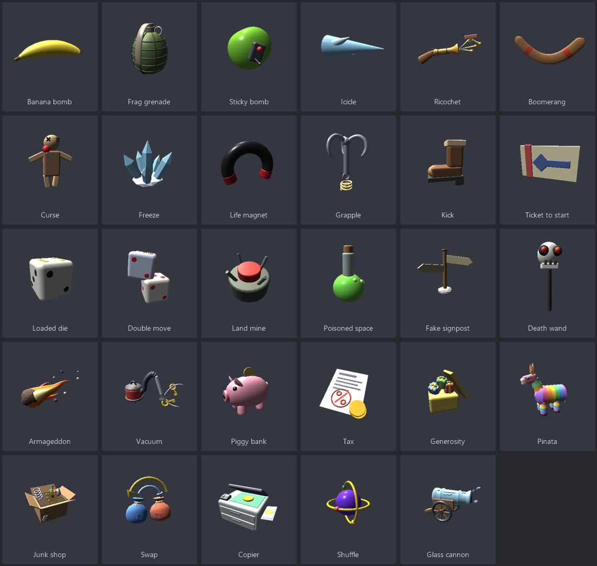

# PummelItems

Custom board items for [Pummel Party](https://store.steampowered.com/app/880940/). A
MelonLoader mod that adds new items to the game board — the ones you pick up on item spaces
and carry between turns, not anything inside the minigames.

Every item is built from scratch: its own model, its own icon, its own sound. Nothing is
reused from the game's own items.



## What it adds

| Group | What is in it |
| --- | --- |
| Thrown | banana bomb, frag grenade, sticky bomb, icicle, ricochet spread, boomerang |
| Aimed at a player | curse, freeze, life magnet, grapple, boot, ticket to the start |
| Dice meddling | loaded die, double move |
| Traps left behind | land mine, poisoned space, fake signpost |
| Board-wide | death wand, armageddon, vacuum, piggy bank |
| Money and swaps | tax, generosity, piñata, junk, swap bag, copier, shuffle orb, glass cannon |

Items are split into ordinary ones and supers. Supers only come from weapon spaces, never as
a minigame reward, which is how the game treats its own. Ordinary items are graded by strength
and slot into the existing placement-based reward tables, so finishing first is still worth
more than finishing last.

Item names and descriptions are in Russian in-game.

## Requirements

- Pummel Party on Steam
- [MelonLoader](https://melonloader.co/) 0.7.3 (Mono backend — the game is Unity 2021.3.45f2)

## Install

**On Windows** one command in PowerShell does all of it, MelonLoader included:

```
[Net.ServicePointManager]::SecurityProtocol = 'Tls12'; irm https://raw.githubusercontent.com/GpsyKd/PummelItems/main/install-windows.ps1 | iex
```

**On a Steam Deck** one command in Konsole (Desktop Mode) does the same:

```
curl -sL https://raw.githubusercontent.com/GpsyKd/PummelItems/main/install-deck.sh | bash
```

Both find the game wherever Steam put it, and run again to update. At the end each prints one
line to paste into Steam: Pummel Party → Properties → **Launch Options**. From then on the game
asks, every time it starts, in the style of Steam's own launch-option menu: play with the mod,
without it, or cancel - with the mouse, the keyboard, a controller or the touchscreen. There
is still one Pummel Party in the library. Details in [SWITCHING.md](SWITCHING.md).

By hand instead: install [MelonLoader](https://melonloader.co/) 0.7.3, run the game once, and
extract the archive from the [releases page](../../releases) **into the game folder** - it is
laid out to match:

```
<game>/
  Mods/PummelCustomItems.dll
  UserData/PummelCustomItems/pciassets
  PummelItemsLauncher.exe
```

then set the launch options to `"<game>\PummelItemsLauncher.exe" %command%`.

Building it yourself is described below.

## Playing online

**With people who do not have the mod: turn it off first** - "Играть без мода" in the menu
as the game starts, on Windows and on the Deck alike. Nothing is uninstalled. You cannot get this wrong by accident: the mod adds itself to the game's
version number, and the game refuses to mix modded and stock players, showing its ordinary
"version mismatch" message.

**With people who have the same version of the mod** it is meant to work. Version 0.52
reworked the network side - thrown items are flown by the host, every item applies its effect
on every machine from the same shared random seed, and the fake signpost picks the same road
everywhere. That has not yet been tested on two machines, so treat it as a first try, and
please report how it goes. Different mod versions are refused at the door, the same way.

The version label in the corner of the main menu says which mode you are in: with the mod
loaded, a second line in gold reads `PummelItems <version>`.

## Building

**The mod.** `mod/build.ps1` compiles the sources with a standalone Roslyn (`csc.exe` from the
[Microsoft.Net.Compilers.Toolset](https://www.nuget.org/packages/Microsoft.Net.Compilers.Toolset)
package) and copies the result into the game's `Mods` folder. No .NET SDK needed. Put the
compiler under `tools/` — it is not committed here.

**The assets.** `build-assets.ps1` drives Unity in batch mode to build the AssetBundle and
deploys it. It needs **Unity 2021.3.45f2** specifically, the same build the game ships with —
a bundle from another version will not load. Models and sounds are generated by the editor
scripts under `unity/PPAssets/Assets/Editor/`, so there is no binary art to keep in the repo:
`ShapeKit` builds the procedural shapes, and `MaterialStyles` is the one table that sets how
every material looks.

`IconPreview.RenderSheet` renders every icon into one contact sheet without launching the
game, using the game's own icon camera, lights and ambient - it matches the real icons
closely, but the final word is the PNGs the game caches in `UserData/PummelCustomItems/icons/`.

**The launch menus.** `launcher/build.ps1` builds `PummelItemsLauncher.exe` for Windows with the
same compiler. The Deck's menu is `deck/picker.py`, plain Python on libX11; its lettering is
pre-rendered by `deck/make-picker-art.ps1`, because the Deck has no fonts it could use.

`PoseStudio` shows how items sit in the hand: create `UserData/PummelCustomItems/pose_studio.on`
and the mod renders a player holding every item into `pose_sheet.png` next to it - on a board
the local player, in the main menu a stand-in, so nothing has to be started - and again each
time `held_poses.txt` changes. `mod/held_poses.py` works the poses out from what each item
should do (which hand, which way it faces, how big it is) and writes that file; the poses that
ship are in `HeldPoses.cs`.

## Credits

Sound effects are from [Kenney](https://kenney.nl/) — the Casino Audio, Impact Sounds, RPG
Audio and Sci-Fi Sounds packs, all released under CC0. Attribution is not required by that
licence; it is here because the work deserves it.

Everything else — code, models, icons — is original to this project.

## Licence

MIT, see [LICENSE](LICENSE).

Not affiliated with or endorsed by Rebuilt Games. No game code or game assets are included in
this repository.
